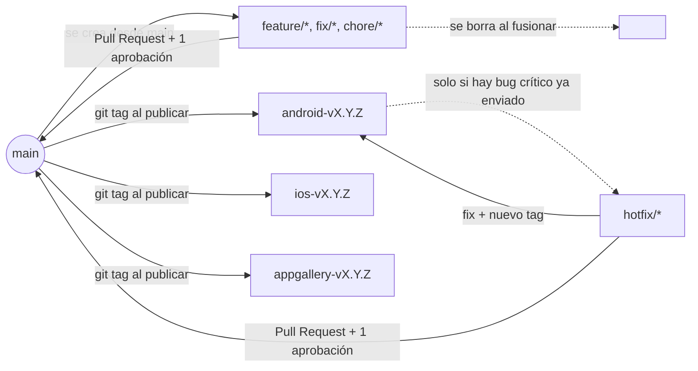

# Gobernanza del repositorio — EVGreen

Este documento es política oficial del proyecto, no una sugerencia. Aplica a
toda persona que trabaje en este repositorio — desarrolladores, agentes de IA
(Manus, Claude, etc.) y cualquiera que se una al equipo en el futuro. Si algo
aquí no se está cumpliendo, se corrige antes de seguir, no se ignora.

Ver también [`CONTRIBUTING.md`](CONTRIBUTING.md) para el detalle operativo día
a día (nombres de rama, versionado, housekeeping mensual). Este documento se
enfoca en **quién es responsable de qué** y en la **protección del repositorio**
ahora que va camino a producción real con usuarios reales.

## Por qué existe esto

Este proyecto no es solo una web app: es una app híbrida (web + Android + iOS,
con AppGallery en camino) construida sobre un único código compartido con
Capacitor, y con una migración a React Native nativo planeada más adelante
(ver hoja de ruta del contrato). Esa combinación — un solo repo, múltiples
tiendas con ciclos de aprobación independientes, y una arquitectura que va a
cambiar — es exactamente el escenario donde los proyectos pierden el control
si no hay reglas claras desde el principio. Este documento las fija.

## 1. Roles y responsabilidades

### Administrador del repositorio ("Primo" / dueño de la organización GitHub)

Es quien tiene (o debe tener) permisos de **Admin** sobre la organización
`greenhproject` en GitHub — el único nivel de permiso que puede cambiar la
visibilidad del repo y configurar protección de ramas. Ahora mismo, ninguna
de las cuentas usadas por el desarrollador o por los agentes de IA en este
proyecto tiene ese nivel de acceso — por diseño. Solo el Administrador puede
hacer estas cosas, y por eso son sus responsabilidades:

- Poner el repositorio en modo **privado**.
- Configurar la **protección de la rama `main`** (checklist exacto en la
  sección 3).
- Dar de alta y de baja colaboradores — nunca dar rol de Admin a alguien más
  sin una razón explícita y documentada.
- Ser (o designar) el **aprobador requerido** antes de que cualquier cambio
  llegue a `main`.
- Revisar cada Pull Request contra el checklist mínimo (sección 4) antes de
  aprobar. No hace falta que lea línea por línea el código si no es su
  perfil — el checklist está diseñado para poder aplicarse sin ser
  desarrollador.
- Nunca saltarse (bypass) la protección de `main`, ni en emergencias, sin
  dejarlo por escrito en el propio Pull Request explicando por qué.

### Desarrollador Líder (Leonardo)

Dueño técnico del código y la arquitectura. Responsabilidades:

- Nunca trabajar directo sobre `main` — toda tarea empieza en una rama corta
  (`feature/*`, `fix/*`, `chore/*`, ver `CONTRIBUTING.md`).
- Probar localmente antes de abrir un Pull Request, siguiendo la disciplina ya
  establecida (reproducir el problema antes de arreglarlo, revisar pantalla
  por pantalla en cambios de UI).
- Dejar evidencia en el Pull Request: qué se probó, en qué dispositivos, con
  qué resultado.
- Etiquetar (`git tag`) cada versión que se envía a una tienda (sección 5).
- Mantener este documento y `CONTRIBUTING.md` actualizados a medida que el
  proyecto cambia — por ejemplo, cuando arranque la migración a React Native.

### Futuros desarrolladores

Mismas reglas que el Desarrollador Líder. Se les da acceso de **colaborador**
(push, no admin) salvo decisión explícita y documentada del Administrador.
Antes de tocar `ios/`, `android/`, `capacitor.config.ts` o cualquier ajuste de
safe-area/viewport, deben leer la nota de mobile al inicio de `todo.md`.

## 2. Modelo de ramas



**`main` es la única rama de larga duración.** Todo lo demás es una rama
corta que se borra apenas se fusiona. No existen (ni deben crearse) ramas
`dev`, `qa`, `staging`, `integration/*` ni una rama por tienda
(`android`, `ios`, `appgallery`).

**Por qué no ramas por tienda ni por ambiente:**

- Android, iOS y AppGallery comparten el mismo código de aplicación
  (`client/src`, `server/`). Solo cambian configuración de build
  (`VITE_API_URL`, scripts `build:android` / `build:ios` en `package.json`) y
  archivos nativos (`ios/`, `android/`) que Capacitor sincroniza. Separar por
  tienda obliga a replicar cada fix en varias ramas — es la causa directa de
  la reconciliación de ~52 commits que se hizo en `integration/mobile-reconcile`
  antes de este documento. No se repite ese error.
- Un modelo `dev/qa/main` (GitFlow clásico) solo aporta valor si hay
  infraestructura de ambientes real detrás (base de datos de QA, tenant de
  Auth0 separado, etc.). Hoy no existe esa infraestructura — se prueba local
  y Railway despliega `main` directo a producción. Meter ramas de ambiente
  sin infraestructura real es burocracia sin beneficio.

**Lo que sí es real y hay que manejar:** web se despliega continuo, pero
mobile pasa por revisión de tienda (días de espera) y un binario ya enviado
no se puede modificar. Esa asimetría se resuelve con dos herramientas, no con
más ramas:

1. **Tags por tienda** en cada envío (sección 5) — saber con certeza qué
   commit está vivo en cada tienda, de forma independiente.
2. **Rama de hotfix bajo demanda** (`hotfix/<slug>`) — única excepción a
   "todo vive en `main`". Se usa *solo* si aparece un bug crítico en una
   versión ya enviada a revisión mientras `main` ya avanzó más allá de esa
   versión: se corta desde el tag de esa tienda, se arregla, se re-etiqueta,
   se fusiona de vuelta a `main` con Pull Request normal, y se borra.

## 3. Protección de `main` — checklist para el Administrador

Esto se configura en GitHub: **Settings → Branches → Branch protection rules
→ Add rule**, con el patrón `main`. Marcar:

- [ ] **Require a pull request before merging** — nadie hace push directo.
- [ ] **Require approvals** — mínimo 1.
- [ ] **Dismiss stale pull request approvals when new commits are pushed** —
      si se aprobó y después se sube un cambio nuevo, se debe re-aprobar.
- [ ] **Do not allow bypassing the above settings** — incluye a los propios
      administradores. Esto es lo que evita que un cambio accidental (de
      cualquiera, incluido el Administrador) llegue directo a producción.
- [ ] **Restrict deletions** — nadie puede borrar `main`, ni con permisos de
      admin.
- [ ] **Block force pushes**.
- [ ] Cuando exista CI configurado: **Require status checks to pass before
      merging**.

Y por separado, en **Settings → General → Danger Zone → Change repository
visibility**: pasar el repositorio de público a **privado**.

Ninguna cuenta usada hoy por el desarrollo (ni por los agentes de IA que
trabajan en este repo) tiene permiso de Admin para hacer esto — se verificó
directamente contra la API de GitHub. Tiene que hacerlo quien sea dueño real
de la organización.

## 4. Checklist mínimo para aprobar un Pull Request a `main`

Pensado para poder aplicarse sin necesidad de leer el código en detalle:

- [ ] El PR explica claramente qué cambia y por qué (no solo "fix bug").
- [ ] El autor indica cómo lo probó (dispositivo/navegador, pasos, resultado).
- [ ] Si toca `ios/`, `android/`, `capacitor.config.ts` o safe-area/viewport
      → el autor confirma explícitamente que revisó el impacto en mobile.
- [ ] No incluye credenciales, tokens ni archivos `.env` con secretos reales.
- [ ] `npx tsc --noEmit` corre sin errores nuevos (o el check de CI está en
      verde, cuando exista).
- [ ] La rama es corta y de un solo propósito — se borra automáticamente al
      fusionar.

## 5. Tags de versión por tienda

Cada vez que se envía una versión a una tienda, se etiqueta el commit exacto
con un tag específico de esa tienda — no un tag genérico — porque cada tienda
aprueba en fechas distintas y hay que poder responder con certeza "qué commit
está vivo ahora mismo en Android / iOS / AppGallery" de forma independiente:

```bash
git tag android-v1.4.0
git tag ios-v1.4.0
git tag appgallery-v1.4.0   # cuando aplique, a partir del Mes 5
git push origin android-v1.4.0 ios-v1.4.0
```

## 6. Migración a React Native — cómo afecta esta política

Esta política está diseñada para no depender de si el código es Capacitor o
React Native — se basa en ramas cortas, tags y protección de `main`, no en la
arquitectura mobile. Cuando arranque la definición de la arquitectura nativa:

- Queda pendiente decidir si el código React Native vive en una carpeta nueva
  dentro de este mismo repo (monorepo) o en un repositorio separado. Esa
  decisión es parte del alcance de esa fase del contrato — no se adelanta ni
  se rediseña la estrategia de ramas hoy alrededor de una arquitectura que
  todavía no está definida.
- Decida lo que decida, esta misma política aplica sin cambios: si el código
  RN termina en un repositorio nuevo, este documento se copia y adapta ahí,
  con el mismo Administrador y las mismas reglas de protección — no se parte
  de cero.

## 7. Cuándo entra en vigor

Desde ya. No se espera a tener "muchos usuarios" para activar la protección
de `main` — el riesgo de un push accidental que rompa producción (Railway
despliega automáticamente en cada push a `main`) ya existe hoy, con el
tráfico que haya. Las barandas de seguridad van antes del riesgo, no después.
