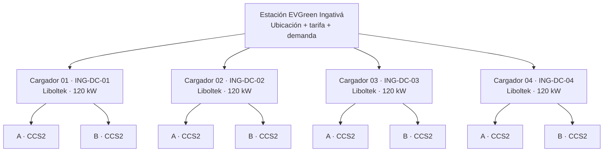

# Arquitectura de Estación, Cargador y Conector para EVGreen

**Fecha:** 22 de septiembre de 2026  
**Autor:** Manus AI

## Conclusión

Para una ubicación como **Estación EVGreen Ingativá**, la aplicación muestra tres niveles claramente separados: la **estación** como la ubicación comercial; el **cargador** como el equipo físico Liboltek con identidad OCPP propia; y el **conector** como cada manguera disponible para el vehículo. La experiencia no usa una lista plana de ocho conectores: presenta tarjetas de equipo, cada una con sus dos salidas identificadas de forma visible y accionable.

> **Estación EVGreen Ingativá** → **Cargador 01 Liboltek, 120 kW** → **Conector A CCS2** y **Conector B CCS2**.

Este modelo coincide con la forma en que se opera la infraestructura: OCPP enlaza el software con el cargador físico, mientras que el usuario necesita saber exactamente en qué equipo y en qué manguera debe conectar su vehículo. OCPP es el protocolo abierto de comunicación entre las estaciones de carga y el sistema de gestión; las versiones recientes incorporan gestión de dispositivos y un manejo más avanzado de transacciones. [1]

## Cómo está organizado actualmente EVGreen

La base técnica ya contiene los tres niveles. La tabla `charging_stations` representa la ubicación. La tabla `chargers` representa el equipo físico y conserva su identidad OCPP, fabricante, modelo, serie, potencia y estado operativo. La tabla `evses` representa cada conector y ya tiene un campo opcional `chargerId` para asociarlo al cargador físico.

El servicio de estado también reconoce esta jerarquía. Cuando necesita enviar una orden a una manguera, primero resuelve el `chargerId` del conector y luego usa la identidad OCPP de ese cargador. Esto es el comportamiento correcto para un punto con varios equipos físicos. Además, el historial de estado puede registrar el cargador y el conector afectados.

La brecha está en el producto de cara al usuario. Las consultas de estación y de inicio de carga todavía entregan una colección plana de `evses`. En la aplicación aparecen como “Conector 1”, “Conector 2” y así sucesivamente. Por ello el usuario no puede distinguir con facilidad si dos mangueras pertenecen al mismo cargador, cuál es el equipo que debe ubicar en el estacionamiento ni cuál identidad OCPP se usará para iniciar la sesión.

## Ejemplo propuesto: Estación EVGreen Ingativá

| Nivel | Identificador visible | Significado operativo | Ejemplo de visualización para el usuario |
|---|---|---|---|
| Estación | **EVGreen Ingativá** | Ubicación, tarifas, horario, disponibilidad consolidada y mapa. | “4 cargadores · 8 conectores · 5 disponibles”. |
| Cargador | **ING-DC-01** a **ING-DC-04** | Equipo físico con fabricante, modelo, potencia, serie, identidad OCPP y capacidad simultánea. | “Cargador 01 · Liboltek · 120 kW DC”. |
| Conector | **A** y **B** | Manguera o salida que se reserva, se selecciona y se vincula a la transacción. | “Conector A · CCS2 · Disponible”. |

En una instalación de cuatro cargadores de 120 kW con dos mangueras CCS2 por cargador, la ficha visible sería la siguiente:



## Experiencia propuesta en la aplicación

### Mapa y ficha de estación

El mapa seguirá mostrando una sola marca para la estación. La tarjeta previa debe indicar capacidad real, por ejemplo: **“EVGreen Ingativá · 4 cargadores DC · 8 conectores · 5 disponibles”**. La cantidad disponible no debe ser un conteo visual fijo. Debe derivarse de la capacidad operativa real de cada equipo y de sus transacciones activas.

Al abrir la estación, el título mostrará el nombre de la ubicación y una barra compacta con disponibilidad: “5 de 8 conectores disponibles” o, cuando aplique, “3 de 4 equipos disponibles”. El usuario no tendrá que comprender OCPP para cargar; la jerarquía será visible mediante tarjetas agrupadas.

Cada tarjeta de cargador incluirá el código grande y legible del equipo, la potencia, el tipo de corriente, el fabricante y los dos conectores. Un estado verde indica que esa salida se puede seleccionar. Un estado azul o naranja indicará reserva u ocupación. Un estado rojo marcará una falla y no ofrecerá una acción de inicio.

```text
┌──────────────────────────────────────────────────┐
│  Cargador 01                         120 kW DC   │
│  ING-DC-01 · Liboltek · ubicado en bahía 1       │
│                                                    │
│  [ A · CCS2 · Disponible ] [ B · CCS2 · Ocupado ]│
│                                                    │
│  Selecciona una salida para continuar             │
└──────────────────────────────────────────────────┘
```

En móvil, la tarjeta no debe mostrar una grilla estrecha de ocho elementos. Debe usar acordeones o tarjetas apiladas. Se abre un cargador a la vez y luego se selecciona A o B mediante botones grandes, con contraste, estado, potencia y un único llamado a la acción.

### QR en el tótem o cargador

La propuesta incluye dos tipos de QR, sin que uno sustituya al otro.

Un **QR de estación** lleva a la ficha de EVGreen Ingativá y permite ver todos los cargadores. Es apropiado para señalización de acceso, el aviso general de la electrolinera y campañas comerciales.

Un **QR de conector** lleva directamente a la tarjeta del equipo físico y resalta la salida exacta. Por ejemplo, el QR instalado al lado de la manguera A de `ING-DC-03` abre: “Estación EVGreen Ingativá → Cargador 03 → Conector A CCS2”. El usuario confirma el vehículo y la modalidad de carga; no tiene que buscar un “Conector 5” ambiguo.

El QR no debe exponer identificadores internos ni aceptar un parámetro manipulable como autorización de carga. Debe contener un identificador público opaco o un token firmado que el servidor valide y resuelva a estación, cargador y conector. La autorización, saldo, reserva y estado real se validan siempre en el backend antes del `RemoteStart`.

### Reserva, carga y asistencia

Cuando una persona reserva, la reserva debe mostrar el activo completo: **“EVGreen Ingativá · Cargador 03 · Conector A · CCS2 · 120 kW”**. El recordatorio, la tarjeta de reserva activa, Push, WhatsApp y la pantalla de inicio de carga deben reutilizar la misma referencia. Esto evita que el cliente llegue a una estación correcta pero a una manguera equivocada.

El botón de ayuda también debe usar esa identidad. Soporte podrá ver “ING-DC-03 / A” junto con los eventos OCPP, el estado, la serie y la transacción. Esto reduce el tiempo de diagnóstico y permite a un técnico actuar sobre el activo físico correcto.

## Regla crítica: dos mangueras no siempre equivalen a dos cargas simultáneas

Antes de habilitar la reserva o el conteo de disponibilidad se debe registrar la **capacidad simultánea** de cada modelo de cargador. Algunos equipos de doble salida permiten una sola sesión a la vez y comparten potencia; otros permiten dos sesiones con reparto dinámico de potencia; otros cuentan con dos módulos de potencia independientes.

No se debe inferir la simultaneidad sólo por la cantidad de mangueras. El modelo incluye, por cargador, `maxConcurrentSessions` y, si aplica, la potencia compartida. Para los Liboltek de doble salida certificados por EVGreen, este valor se configura en **2**, de modo que A y B pueden reservarse y cargar de forma independiente. Para un equipo de una sola sesión concurrente, el valor es **1**: cuando A esté cargando, B se presentará como **“No disponible: el cargador atiende otra sesión”**, no como disponible. La reserva también debe tomarse contra esa capacidad del equipo y no únicamente contra una manguera aislada.

| Configuración física certificada | Capacidad disponible que debe mostrar la app | Regla de reserva |
|---|---|---|
| Dos mangueras, una sesión a la vez | Un cupo por cargador | Reservar capacidad del cargador; A/B son la salida elegida al llegar. |
| Dos mangueras, dos sesiones con potencia compartida | Dos cupos, con potencia dinámica explícita | Reservar el conector y mostrar potencia estimada bajo uso compartido. |
| Dos salidas independientes | Dos cupos | Reservar cada conector de forma independiente. |

La ficha técnica del fabricante y la configuración aceptada por el equipo de ingeniería deben determinar esta propiedad durante el alta del cargador. No debe inferirse de la cantidad de cables visibles.

## Cambios de producto y datos recomendados

El cambio debe aprovechar la tabla `chargers` existente y ser compatible con las estaciones que hoy sólo tienen conectores planos. No se deben eliminar ni recrear activos, transacciones, reservas ni eventos OCPP históricos.

Primero se añadieron a `chargers` los campos de presentación y operación `chargerCode`, `displayName` y `maxConcurrentSessions`. A cada `evse` se añadieron `connectorLabel` —por ejemplo, A o B— y `qrToken` opaco. El campo `chargerId` existente se utiliza para los nuevos equipos, mientras los registros históricos no asignados aparecen temporalmente en el grupo “Conectores pendientes de organizar”.

Segundo, las APIs de estación, QR e inicio de carga deben devolver una estructura agrupada: estación, lista de cargadores y conectores por cargador. Las APIs antiguas pueden conservar una lista plana derivada durante una transición controlada para no romper el mapa ni el NOC.

Tercero, el alta administrativa debe ser un asistente de cuatro pasos: crear la estación; registrar el equipo físico con marca, modelo, identidad OCPP y serie; definir sus conectores y capacidad simultánea; y generar los dos QR imprimibles. La vista de administración debe mostrar una vista previa idéntica a la aplicación de cliente, así se verifica el nombre, código y mangueras antes de publicar.

Cuarto, el inicio de carga debe resolver el QR o la selección del usuario hasta el `evseId` correcto. A partir de ese EVSE, el CSMS debe obtener el `chargerId` y utilizar la identidad OCPP del equipo físico. El código actual ya contempla este recorrido; la implementación debe convertirlo en el camino obligatorio para los equipos multicharger, conservando un fallback temporal sólo para instalaciones legacy.

## Validaciones necesarias antes de producción

La primera validación debe confirmar que cada equipo físico tiene una identidad OCPP única y que cada una de sus salidas pertenece al `chargerId` correcto. La segunda debe comprobar que un inicio sobre `ING-DC-03 / A` sólo envía el comando a `ING-DC-03`, nunca al identificador general de la estación ni a otro equipo.

La tercera debe probar los tres modos de simultaneidad descritos en la tabla. La cuarta debe verificar que una reserva reduce la capacidad correcta y que el mecanismo de protección de reservas no permite iniciar una carga que invada el turno posterior. La quinta debe cubrir QR de estación, QR de equipo y QR de salida, incluyendo QR inválidos, revocados y de otro tenant. Finalmente, debe verificarse en teléfonos Android e iOS que el nombre de estación, código de equipo, letra del conector y estados en tiempo real coinciden entre el mapa, la ficha, el QR, la reserva, el NOC y la transacción.

## Decisión recomendada

La implementación para Ingativá mantiene una sola **Estación EVGreen Ingativá** y permite registrar cuatro **cargadores físicos Liboltek**: `ING-DC-01` a `ING-DC-04`. Cada uno tiene dos salidas visibles A y B y se configura con `maxConcurrentSessions = 2`, por lo cual ambas reservas y cargas son independientes. Los demás modelos conservan una capacidad configurable según su ficha técnica certificada.

El usuario debe poder entrar por el mapa, por el QR general o por un QR de manguera. Cualquiera de los tres caminos debe terminar en la misma selección inequívoca del activo: **estación, cargador, conector**. Esto da una interfaz sencilla para el conductor y una trazabilidad exacta para operación, mantenimiento, facturación, soporte y auditoría.

## References

[1]: https://openchargealliance.org/protocols/open-charge-point-protocol/ "Open Charge Point Protocol — Open Charge Alliance"
