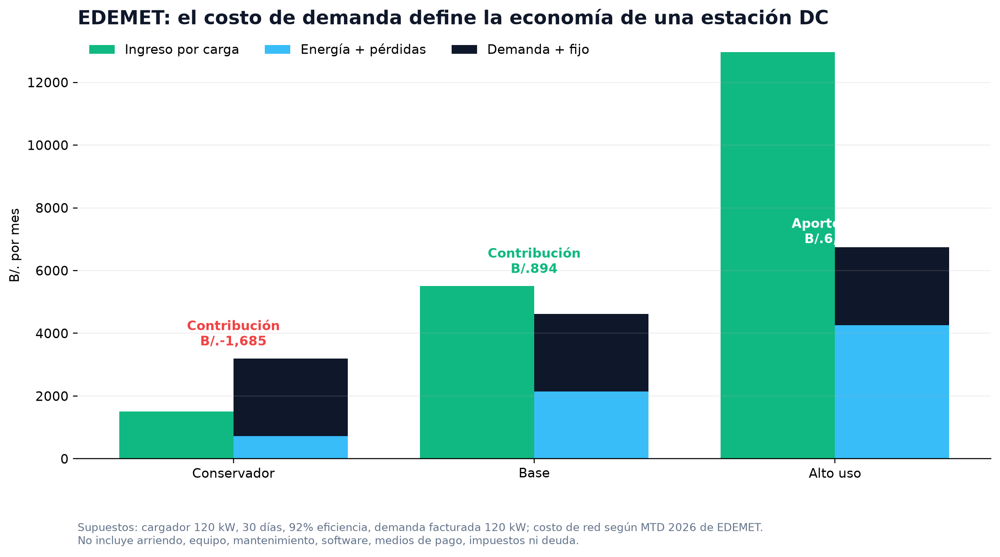
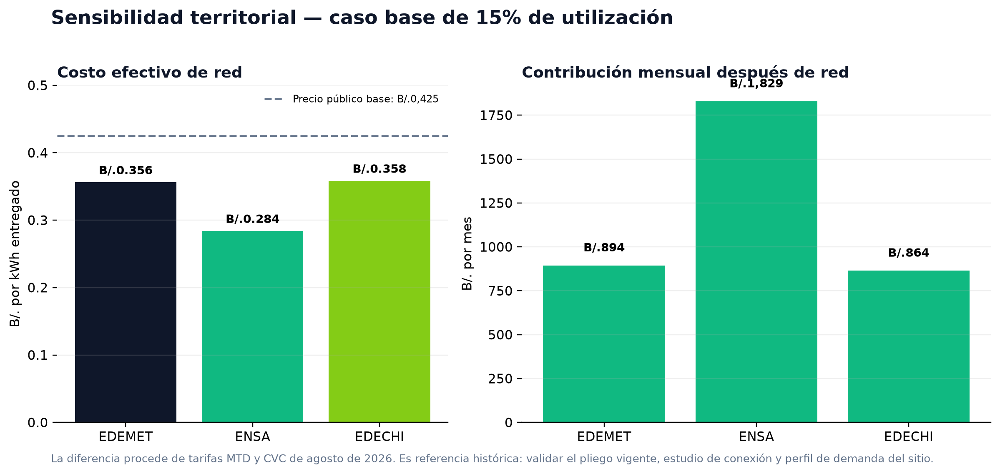
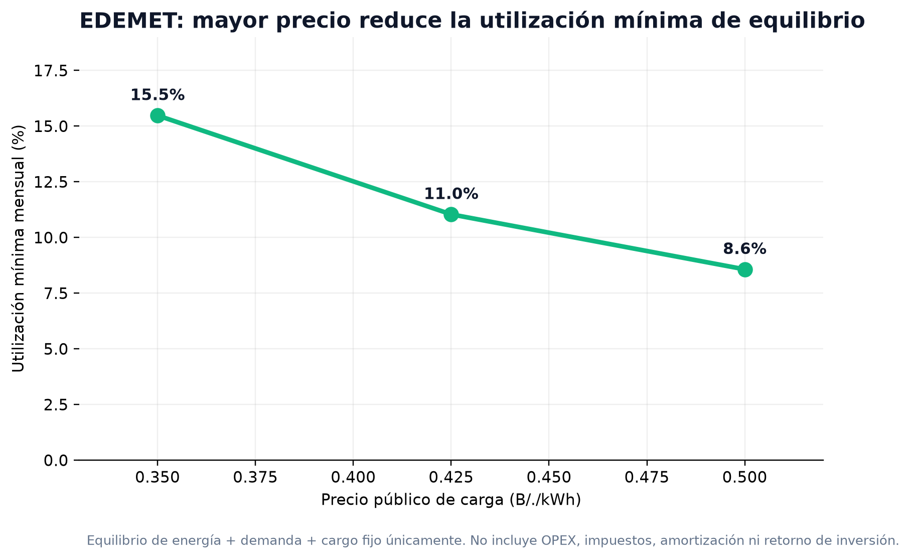

# Estudio de mercado: carga rápida pública en Panamá

**Preparado para:** Green House Project SAS · Línea EVGreen  
**Fecha de corte:** 1 de septiembre de 2026  
**Moneda:** B/. (balboa) y USD, tratados 1:1 solo para lectura comercial  
**Propósito:** establecer una base verificable para diseñar el modelo de negocio y, posteriormente, una presentación de entrada a Panamá.

> **Conclusión ejecutiva.** En Panamá no es técnicamente correcto hablar de un único “costo de compra por kWh” para una estación rápida. El costo de energía regulada de referencia puede estar alrededor de **B/.0,120–0,164 por kWh entregado** antes de demanda; sin embargo, el cargo por demanda puede elevar el costo efectivo de una estación DC de 120 kW a aproximadamente **B/.0,284–0,358/kWh** en el caso base de 15% de utilización, según zona. El rango público observado de venta de DC, **B/.0,35–0,50/kWh**, puede ser viable, pero no protege una ubicación de baja utilización. [1] [2]

## 1. Alcance, método y jerarquía de evidencia

El estudio separa la evidencia en tres niveles. Primero, los pliegos de la Autoridad Nacional de los Servicios Públicos (ASEP) se usan para describir los componentes y precios de referencia de la red. Segundo, las fuentes de operadores y sectoriales se emplean para observar tarifas públicas y competencia. Tercero, el modelo calcula escenarios reproducibles; no proyecta demanda contratada ni sustituye una cotización de conexión.

| Variable | Fuente y estado | Tratamiento en el estudio |
|---|---|---|
| Precio de venta público DC | Banda observada de **B/.0,35–0,50/kWh** para Evergo en fuente sectorial secundaria | Rango comercial a validar con capturas de app, cotización o contrato. [1] |
| Energía y demanda de red | Pliegos ASEP para ene–ago 2026; última tabla publicada y accesible al corte | Referencia inmediata, no tarifa vigente confirmada para septiembre de 2026. [2] [3] |
| Factor de pérdidas del cargador | Supuesto de modelación: **92%** de eficiencia de entrega | Sensibilidad técnica; debe sustituirse por curva certificada del equipo. |
| Demanda facturada | Supuesto: **120 kW** para un cargador DC de 120 kW | Caso conservador; requiere estudio de simultaneidad y gestión de carga. |
| Utilización | Escenarios de 5%, 15% y 30% | Sensibilidades, no forecast comercial. |

La información regulatoria es particularmente relevante porque el periodo septiembre 2026–2030 está en transición. La consulta de pliegos de EDEMET/EDECHI reconoce que no existe una tarifa dedicada de movilidad eléctrica y plantea utilizar categorías existentes, con posibilidad de medidor separado. [4]

## 2. ¿A cuánto se vende un kWh de carga rápida pública?

La evidencia de mercado disponible identifica una banda de **B/.0,35 a B/.0,50 por kWh** para carga rápida Nivel 3 en Panamá. Es un rango útil para orientar el modelo, pero no equivale a un tarifario universal: las redes pueden usar precios dinámicos, membresías, penalidades de ocupación, promociones o precios distintos por ubicación. [1]

| Banda observada | Posición en el modelo | Lectura operativa |
|---:|---|---|
| B/.0,350/kWh | Extremo de entrada / conservador | Exige alta eficiencia de demanda y volumen suficiente. |
| B/.0,425/kWh | Punto medio de trabajo | Útil para evaluar ubicación, no para publicar una tarifa definitiva. |
| B/.0,500/kWh | Extremo alto observado | Reduce el punto de equilibrio de energía y demanda, sujeto a competencia y elasticidad. |

La red Evergo se presenta como red de carga Nivel 3 y la documentación pública de Panamá también identifica a ENSA, Celsia, Greenspace, Terpel Voltex y otros actores como parte del entorno de recarga. Esto significa que el proyecto debe competir por **ubicación, disponibilidad, potencia real, experiencia digital y alianzas**, no solo por precio. [5] [6]

## 3. ¿Cuál es el costo de compra desde la red?

Para una estación rápida, el componente de energía no es el costo completo. La facturación regulada suma consumo, demanda máxima, cargo fijo, pérdidas, transmisión y ajuste de combustible. ASEP establece que la demanda se registra como máxima en intervalos de 15 minutos; en consecuencia, un pico breve puede determinar un cargo mensual significativo. [2]

### 3.1 Referencia MTD: cargo de energía y demanda

La siguiente tabla usa la categoría **media tensión con demanda máxima (MTD)** como referencia para una estación de 120 kW. Las cifras son de la tabla oficial vigente entre enero y agosto de 2026, más el ajuste de combustible publicado para agosto. No deben considerarse una oferta vigente después de ese periodo. [2] [3]

| Área de distribución | Energía MTD | CVC agosto | Energía + CVC | Demanda | Cargo fijo |
|---|---:|---:|---:|---:|---:|
| EDEMET | B/.0,16001/kWh | -B/.0,00915/kWh | **B/.0,15086/kWh** | B/.20,62/kW-mes | B/.14,27/mes |
| ENSA | B/.0,15396/kWh | +B/.0,00052/kWh | **B/.0,15448/kWh** | B/.12,45/kW-mes | B/.9,06/mes |
| EDECHI | B/.0,13479/kWh | -B/.0,01510/kWh | **B/.0,11969/kWh** | B/.24,53/kW-mes | B/.14,21/mes |

Una estación pública también debe analizar alternativas horarias MTH/BTH. La propuesta 2026–2030 de EDEMET/EDECHI conserva categorías de demanda y bloques, y sitúa la punta en días hábiles de 09:01 a 17:00. La capacidad de desplazar carga puede disminuir el componente energético en ciertas horas, pero un solo pico puede mantener material el cargo de demanda. [4]

## 4. Modelo reproducible: estación DC de 120 kW

El modelo se ejecutó con un equipo de 120 kW, 30 días de operación, 92% de eficiencia de entrega y 120 kW de demanda facturada. El resultado se presenta como **contribución después de electricidad de red**: no incluye arriendo, CAPEX, mantenimiento, plataforma, medios de pago, seguros, personal, impuestos, deuda ni retorno de capital.

### 4.1 Escenarios EDEMET

| Escenario | Utilización | Precio venta | kWh entregados/mes | Ingreso/mes | Costo total de red/mes | Costo efectivo | Contribución tras red |
|---|---:|---:|---:|---:|---:|---:|---:|
| Conservador | 5% | B/.0,350 | 4.320 | B/.1.512 | B/.3.197 | B/.0,740/kWh | **-B/.1.685** |
| Base | 15% | B/.0,425 | 12.960 | B/.5.508 | B/.4.614 | B/.0,356/kWh | **B/.894** |
| Alto uso | 30% | B/.0,500 | 25.920 | B/.12.960 | B/.6.739 | B/.0,260/kWh | **B/.6.221** |

La lectura es directa: en el caso conservador, vender B/.0,35/kWh no cubre siquiera energía y red porque el cargo de demanda se distribuye sobre pocos kWh. En el escenario base el margen después de red es positivo pero aún no cubre el resto de OPEX. El caso de alto uso mejora significativamente la absorción de demanda; esa es la condición que debe guiar la estrategia de ubicación y alianzas de flota.

### 4.2 Sensibilidad territorial en el caso base

Con 15% de utilización y precio de venta de B/.0,425/kWh, el costo efectivo es menor bajo la referencia ENSA principalmente por su cargo de demanda, no por una diferencia material en el componente de energía. El orden relativo puede cambiar con el pliego posterior a agosto, el voltaje de conexión y el perfil horario del sitio. [2] [3]

| Distribuidora | Costo efectivo de red | Contribución mensual después de red |
|---|---:|---:|
| EDEMET | B/.0,356/kWh | B/.894 |
| ENSA | B/.0,284/kWh | B/.1.829 |
| EDECHI | B/.0,358/kWh | B/.864 |

### 4.3 Punto de equilibrio técnico de EDEMET

El punto de equilibrio considera solo electricidad y red; por ello representa un umbral mínimo, no una condición de inversión. A B/.0,35/kWh, el proyecto necesita 13.378 kWh mensuales entregados, equivalentes a **15,5% de utilización**, antes de cualquier OPEX. A B/.0,425/kWh el umbral baja a **11,0%** y a B/.0,50/kWh a **8,6%**.

## 5. Implicaciones para el modelo de negocio EVGreen

La entrada responsable no debe basarse en “revender energía con margen por kWh”. Debe construirse como un negocio de red donde el precio público, la gestión de potencia y la utilización están conectados. La recomendación es iniciar con una cartera escalonada de ubicaciones ancla: EDS, centros comerciales, destinos de alto tiempo de permanencia, corredores interurbanos y flotas. La prioridad debe ser asegurar tráfico verificable o acuerdos de volumen antes de instalar potencia DC alta.

| Segmento de sitio | Utilización de referencia | Decisión preliminar | Palanca de valor |
|---|---:|---|---|
| Ancla / corredor / flota | ≥20% | Apto para DC rápido sujeto a conexión | Convenio de volumen, precio dinámico y alta disponibilidad. |
| Urbano seleccionado | 12–20% | Apto con control estricto de demanda | Cargador modular, límite de potencia, tarifa horaria y co-inversión. |
| Baja rotación | <12% | No justificar 120 kW sin subsidio o demanda contratada | AC/destino, menor capacidad DC o fase piloto. |

El precio dinámico debe usar un piso económico por ubicación, no una única tarifa nacional:

> **Precio mínimo operativo = costo variable de red + (demanda y fijo estimados ÷ kWh esperados) + costos transaccionales + OPEX variable + margen objetivo.**

Un segundo carril de monetización puede incluir acuerdos B2B de flotas, comisión comercial con anfitriones, membresías de usuarios, publicidad o retail de sitio, y servicios de operación de red. Cada línea debe modelarse por separado y no compensar artificialmente un punto de carga que no cubre su costo eléctrico.

## 6. Ruta regulatoria y de compra de energía

Panamá permite a grandes clientes negociar libremente términos de **energía** con agentes del mercado, según el marco citado por ASEP; la potencia y los cargos de red mantienen reglas específicas según la conexión. La elegibilidad de cada SPV, el requisito de demanda y el tratamiento de potencia no se deben asumir solo por la potencia nominal del cargador. Deben confirmarse por escrito con la distribuidora, ASEP, asesor regulatorio local y, de ser pertinente, el agente vendedor. [7]

| Decisión | Recomendación antes de comprometer CAPEX |
|---|---|
| Distribuidora y tensión de conexión | Solicitar estudio de factibilidad, presupuesto de conexión, tensión y potencia disponible. |
| Tarifa | Comparar MTD/MTH/ATD/ATH con datos horarios de uso estimado; solicitar pliego semestral vigente. |
| Demanda | Modelar máximos simultáneos, gestión de potencia y baterías antes de aceptar demanda contratada. |
| Energía mayorista | Validar elegibilidad de Gran Cliente, energía contratada, potencia/cargos de red, garantías y riesgos de volumen. |
| Impuestos | Confirmar con asesor fiscal local el ITBMS y tratamiento de la recarga como venta de energía o servicio. |

## 7. Información pendiente antes de usar el caso en una presentación de inversión

El estudio permite crear una narrativa comercial coherente, pero no una proyección definitiva. Para completar un modelo bancable se requieren cotizaciones y evidencias que el análisis público no reemplaza: pliego post-agosto 2026 de cada concesionaria, estudio de conexión y cargo de obra, precio observado por ubicación en apps de operadores, curva de demanda de cada anfitrión, costos de interconexión/transformación, evidencia de vehículos y flotas en el área, condiciones fiscales y cotizaciones de OPEX/CAPEX.

La recomendación concreta es construir el modelo Panamá por sitio y después consolidarlo. Un primer piloto de estaciones ancla con contratos de anfitrión y flota permitirá calibrar utilización, potencia y elasticidad de precio; con esa evidencia se podrá elegir una tarifa dinámica sustentable y un ritmo de expansión realista.

## Referencias

[1] [PideTuCarro, “How Much Does It Cost to Charge an Electric Car in Panama? Real Costs 2026”](https://pidetucarro.com/en/blog/how-much-to-charge-ev-panama/).  
[2] [ASEP, “Tarifas de electricidad para clientes regulados, enero–agosto 2026”](https://asep.gob.pa/wp-content/uploads/electricidad/tarifas/01_tarifas_clientes_regulados/tarifas_2023-2026/2026/agosto/II_t_2026.pdf).  
[3] [ASEP, “Variación por combustible, agosto 2026”](https://asep.gob.pa/wp-content/uploads/electricidad/tarifas/01_tarifas_clientes_regulados/tarifas_2023-2026/2026/agosto/II_vc_2026.pdf).  
[4] [ASEP, “Propuesta de Pliego Tarifario EDEMET/EDECHI, periodo 2026–2030”](https://asep.gob.pa/wp-content/uploads/electricidad/consultas_publicas/2026/cp_008-26/EDEMET/informe_general_pliego_edemet_edechi_2026.pdf).  
[5] [Evergo, “Preguntas frecuentes”](https://evergo.com/soporte/preguntas-frecuentes/).  
[6] [Secretaría Nacional de Energía de Panamá, “Movilidad Eléctrica en Panamá”](https://storymaps.arcgis.com/stories/1c91404606574097aa880e3062366451).  
[7] [ASEP, “Criterios y procedimientos para venta de energía y potencia a Grandes Clientes”](https://faolex.fao.org/docs/pdf/pan95296.pdf).  
[8] [pv magazine, “Panamá cuenta con 1.584 vehículos eléctricos en circulación”](https://www.pv-magazine-latam.com/2025/03/07/panama-cuenta-con-1584-vehiculos-electricos-en-circulacion/).
